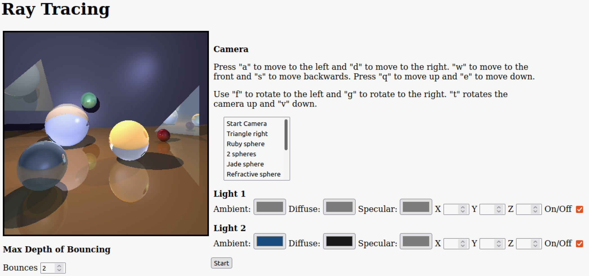
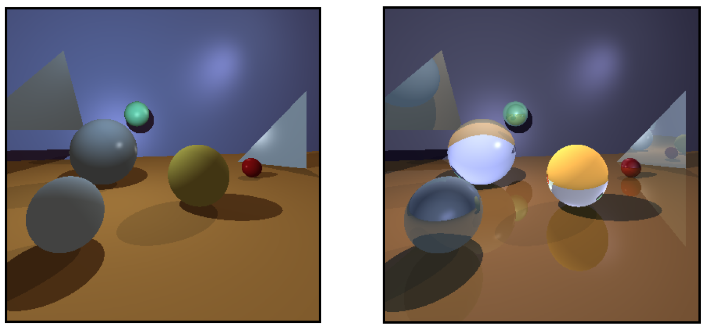

# Raytracing

Scene formed by spheres, planes, and triangles, and illuminated using the ray tracing algorithm in JavaScript. The scene has two lights, whose position and color (ambient, specular, and diffuse) can be modified in the HTML input elements. Moreover, the camera can be moved around the scene, as well as rotated, using specific key inputs. A list of saved camera positions is also available.

The number of bounces indicates how many times the rays bounce on the objects' surfaces, which affects their reflections and refractions. Here is a comparison between zero and one bounce.

